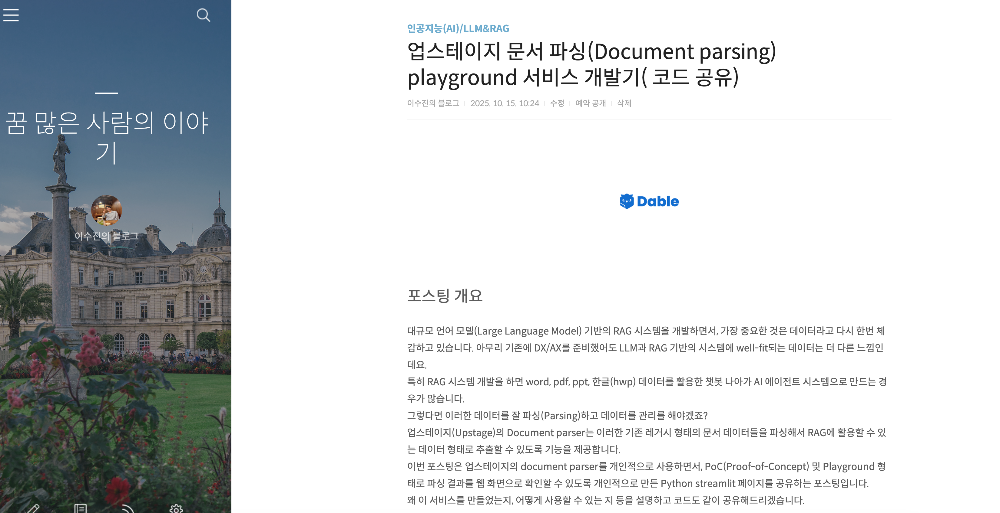

# Upstage Document Parser Playground

Streamlit 기반의 웹 UI로, Upstage Document API의 파싱 결과를 시각적으로 검증하는 테스트 도구입니다.

 | 
---|---

---

## 주요 기능

#### 상세한 설명
- https://lsjsj92.tistory.com/703


* **다양한 포맷 지원**: 업스테이지의 document parsing  API를 이용해 PDF, DOCX, PPTX, HWP 등 문서 파싱
* **결과 시각화**: HTML 렌더링, Bounding Box 좌표, Element 상세 정보 확인

---

## 실행 방법

### 1. 사전 준비

* [Upstage Console](https://console.upstage.ai/)에서 **API Key** 발급
* **Python 3.9+** 설치

### 2. 설치 및 설정

```bash
# 1. 프로젝트 복제 및 이동
git clone https://github.com/lsjsj92/upstage-document-parser-playground.git
cd upstage-document-parser-playground

# 2. 필요 라이브러리 설치
pip install -r requirements.txt

# 3. API 키 설정
cp .env.tmp .env
# .env 파일에 발급받은 API 키를 입력하세요.
```
## 서버 실행 
1. 터미널 1: 백엔드 실행
- python -m uvicorn backend.main:app --reload

2. 터미널 2: 프론트엔드 실행
- streamlit run frontend/app.py

브라우저에서 http://localhost:8501로 접속하세요.

# 파일 구조

.
├── LICENSE
├── README.md
├── .env.tmp (.env 파일로 변경)
├── asset
├── backend
│   ├── __init__.py
│   ├── config.py
│   ├── main.py
│   ├── models
│   │   ├── __init__.py
│   │   └── document.py
│   ├── routers
│   │   ├── __init__.py
│   │   └── routes.py
│   ├── services
│   │   ├── __init__.py
│   │   ├── file_processor.py
│   │   ├── storage.py
│   │   └── upstage_client.py
│   └── utils
│   ├── __init__.py
│   └── helpers.py
├── frontend
│   ├── __init__.py
│   ├── app.py
│   ├── components
│   │   ├── __init__.py
│   │   ├── document_viewer.py
│   │   ├── element_viewer.py
│   │   └── file_uploader.py
│   └── utils
│   ├── __init__.py
│   └── config.py
├── requirements.txt